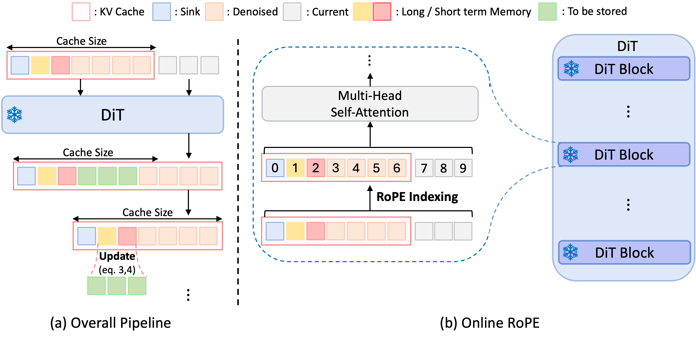

# 💾 MemRoPE: Training-Free Infinite Video Generation via Evolving Memory Tokens

[](https://arxiv.org/abs/xxxx.xxxxx)
[](https://github.com/YoungRaeKimm/MemRoPE)
[](https://memrope.github.io)

[Youngrae Kim](https://youngraekimm.github.io/)\* · [Qixin Hu](https://scholar.google.com/citations?user=EqD5GP8AAAAJ&hl=en)\* · [C.-C. Jay Kuo](https://mcl.usc.edu/people/cckuo/) · [Peter A. Beerel](https://sites.usc.edu/eessc/people/)

**University of Southern California** · *\*Equal contribution*

## 💡 TL;DR

Autoregressive video diffusion models forget the past due to sliding-window KV cache eviction, causing identity drift and quality degradation over time. **MemRoPE** fixes this *without any training* by (1) compressing evicted frames into continuously evolving **Memory Tokens** via dual-rate EMA, and (2) storing keys *without* RoPE and re-applying position encoding on the fly (**Online RoPE Indexing**), so that temporal aggregation stays mathematically valid and positions never leave the trained range. The result: **up to 1-hour video generation** with a fixed-size cache and no fidelity loss.



## TABLE OF CONTENTS
1. [Highlights](#-highlights)
2. [Supported Base Models](#-supported-base-models)
3. [Requirements](#-requirements)
4. [Installation](#-installation)
5. [Quick Start](#-quick-start)
6. [Method Overview](#-method-overview)
7. [Configuration](#-configuration)
8. [Acknowledgements](#-acknowledgements)
9. [Citation](#-citation)
10. [License](#-license)

## ✨ Highlights

- **Memory Tokens** — Dual-rate EMA continuously compresses all past frames into long-term and short-term memory streams, maintaining both persistent identity and recent dynamics within a fixed-size cache.
- **Online RoPE Indexing** — Stores keys *without* RoPE and applies block-relative position encoding dynamically at attention time, making EMA aggregation mathematically well-defined and resolving positional extrapolation.
- **Training-Free** — No fine-tuning required; works as a drop-in replacement for the KV cache management.
- **Unbounded Generation** — Fixed 12-frame KV cache enables generation from 30 seconds to 1 hour+ with constant memory.

## 🤖 Supported Base Models

| Base Model | Checkpoint | LoRA |
|---|---|---|
| [LongLive](https://github.com/NVlabs/LongLive) | `longlive_base.pt` + `lora.pt` | ✅ |

## 💻 Requirements

- **1-GPU mode**: NVIDIA GPU with 40 GB+ VRAM (e.g., A100, A6000)
- **2-GPU mode**: 2× NVIDIA GPUs with 24 GB+ VRAM each (e.g., RTX 3090 / 4090, A5000)
- Python ≥ 3.10
- PyTorch ≥ 2.5.0
- CUDA ≥ 12.1

## 📦 Installation

```bash
# Create conda environment
conda create -n memrope python=3.10 -y
conda activate memrope

# Install PyTorch (adjust for your CUDA version)
pip install torch torchvision --index-url https://download.pytorch.org/whl/cu124

# Install dependencies
pip install -r requirements.txt

# (Optional) Install flash-attn for faster attention
pip install flash-attn --no-build-isolation
```

## 🚀 Quick Start

### 1. Download Checkpoints

```bash
bash scripts/download_checkpoints.sh
```

This downloads:
- **Wan2.1-T2V-1.3B** base model
- **LongLive** base + LoRA checkpoint

### 2. Run Inference

**Single GPU (40 GB+ VRAM):**
```bash
python inference.py \
    --config_path configs/longlive/memrope_60s.yaml \
    --start_idx 0 --end_idx 1
```

**Dual GPU (24 GB+ each):**
```bash
python inference_2gpu.py \
    --config_path configs/longlive/memrope_120s.yaml \
    --start_idx 0 --end_idx 1
```

> [!TIP]
> See `scripts/` for more inference examples and batch generation scripts.

## 🔬 Method Overview

MemRoPE maintains a **Three-Tier Cache** with fixed size regardless of video length:

```
[Sink Tokens] + [Memory Tokens (Long + Short)] + [Local Window] + [Current Chunk]
      (3)                 (1+1)                       (4)              (3)
```

| Tier | Count | Description |
|---|---|---|
| **Sink Tokens** | 3 | First generated frames, always preserved (attention sink) |
| **Memory Tokens** | 1+1 | Dual-stream EMA compressing evicted frames — long-term (α=0.01) for full history, short-term (α=0.1) for recent dynamics |
| **Local Window** | 4 | Last denoised frames providing recent context |
| **Current Chunk** | 3 | New frames being denoised |

### Online RoPE Indexing

Standard practice stores keys with RoPE already applied. This prevents meaningful aggregation (averaging keys with different rotary phases is ill-defined) and causes positional extrapolation beyond the training range.

MemRoPE instead:
1. **Stores all keys without RoPE** in the cache (position-free caching)
2. **Applies block-relative RoPE on the fly** at each attention step with indices `[0, 1, ..., cache_size-1]` — positions never exceed the training range, and EMA aggregation stays valid

## ⚙️ Configuration

### Key Parameters

| Parameter | Description | Default |
|---|---|---|
| `compression_method` | Cache compression method (`ema` / `eviction`) | `ema` |
| `local_attn_size` | Total KV cache size in frames | `12` |
| `sink_size` | Number of sink frames to preserve | `3` |
| `recent_size` | Number of recent frames to preserve | `4` |
| `ema_alpha_long` | Long-term EMA update rate | `0.01` |
| `ema_alpha_short` | Short-term EMA update rate | `0.1` |
| `use_block_rope` | Enable Online RoPE Indexing | `true` |
| `num_output_frames` | Total latent frames to generate | varies |
| `long_video_mode` | Enable chunked VAE decode (for >60 s) | `false` |
| `vae_chunk_size` | Frames per VAE decode chunk | `120` |
| `use_ema` | Use EMA weights from checkpoint | `false` |

### Duration Guide

| Duration | Latent Frames | `long_video_mode` | A6000 (measured) | H100 (estimated) |
|---|---|---|---|---|
| 30 s | 120 | `false` | ~2 min | ~30 s |
| 60 s | 240 | `false` | ~3 min | ~1 min |
| 120 s | 480 | `true` | ~6 min | ~2 min |
| 240 s | 960 | `true` | ~13 min | ~4 min |
| 480 s | 1920 | `true` | ~25 min | ~8 min |
| 1 hour | 14400 | `true` | ~3 hours | ~1 hour |

## 🙏 Acknowledgements

This project builds upon the following works:

- [**Self-Forcing**](https://github.com/guandeh17/Self-Forcing) — Autoregressive video generation with self-forcing training
- [**LongLive**](https://github.com/NVlabs/LongLive) — Real-time interactive long video generation
- [**Wan2.1**](https://github.com/Wan-Video/Wan2.1) — Base video diffusion model
- [**Deep Forcing**](https://github.com/cvlab-kaist/DeepForcing) — KV cache structure design inspiration
- [**MovieGenBench**](https://ai.meta.com/research/movie-gen/) — Evaluation prompts from Meta's Movie Gen

## 📄 Citation

If you find this work useful, please consider citing:

```bibtex
@article{memrope,
  title={MemRoPE: Training-Free Infinite Video Generation via Evolving Memory Tokens},
  author={Kim, Youngrae and Hu, Qixin and Kuo, C.-C. Jay and Beerel, Peter A.},
  journal={arXiv preprint},
  year={2026}
}
```

## 📝 License

This project is licensed under the [Apache License 2.0](LICENSE).
